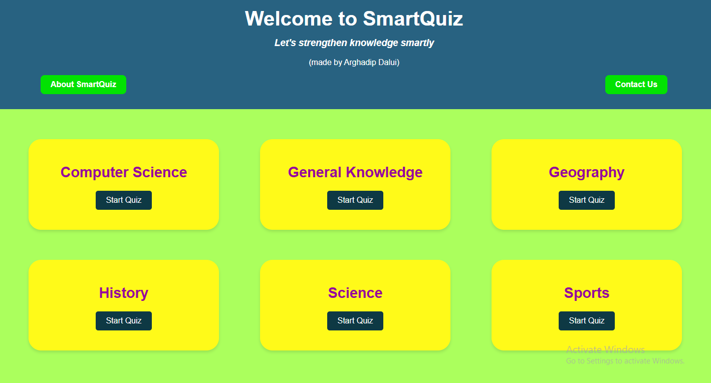

# 🧠 SmartQuiz  
An interactive web-based quiz platform built with **HTML, CSS, and JavaScript**, designed to make learning fun, visual, and trackable!  

---

## 🚀 Features  
✅ Category-based quizzes (Computer Science, JavaScript, HTML, CSS, etc.)  
✅ Dynamic question rendering using JavaScript  
✅ Score tracking and live progress bar  
✅ Feedback system for right and wrong answers  
✅ Navigation buttons for Previous / Next  
✅ Clean, responsive UI with elegant design  

---

## 🖼️ Preview  
  

---

## 🛠️ Tech Stack  
- **Frontend:** HTML5, CSS3, JavaScript  
- **Design:** Flexbox layout, responsive components  
- **Hosting:** GitHub Pages  

---

## 📂 Project Structure  
SmartQuiz/
│
├── about.html # About project
├── contact.html # Contact author(me-Arghadip Dalui)
├── index.html # Homepage (Select quiz category)
├── preview.png # Homepage picture
├── questions.json # Quiz questions
├── quiz.html # Quiz interface
├── README.md # Project details
├── script.js # Dynamic logic for quiz handling
└── style.css # Stylesheet

---

## 🧩 How It Works  
1. User selects a quiz category from `index.html`  
2. Questions are dynamically fetched based on that category  
3. Real-time score and progress bar updates after each question  
4. Final result displayed with score and percentage  
5. Option to return Home and try another quiz  

---

## ⚙️ Setup & Run Locally  
1. Clone this repo  
   ```bash
   git clone https://github.com/ARGHADIP-DALUI/SmartQuiz.git